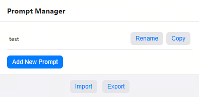
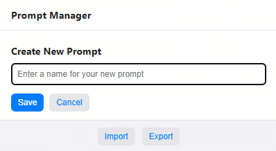
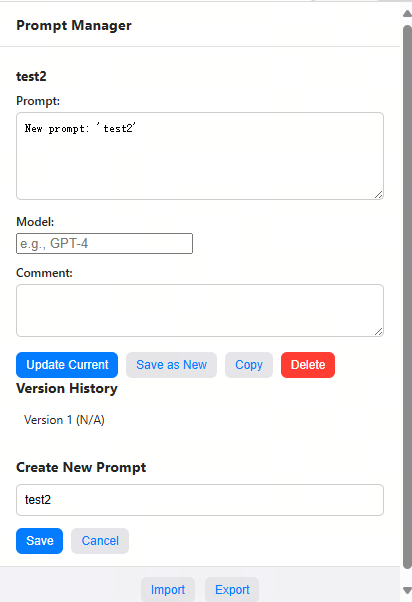

# Features

- ADD prompt as you wish, and manage each version you create.
- USE prompt any where you want through clipboard, just like a normal extension.
- EXPORT and IMPORT your prompts. `NO SERVER CONNECT`. KEEP your prompts safe.
- `SAVE text from any where` to your prompt through the right-click menu.

# Usage

1. Clone the repository or download the source code zip file.
2. Navigate to the project directory.
3. If you are using edge, goto `edge://extensions/` and add this extension by clicking `Load unpacked`.

### Home page

### New prompt

### Add prompt

