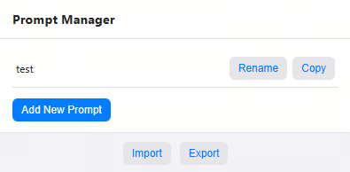
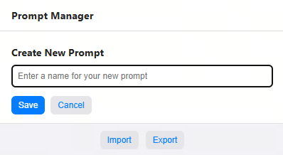
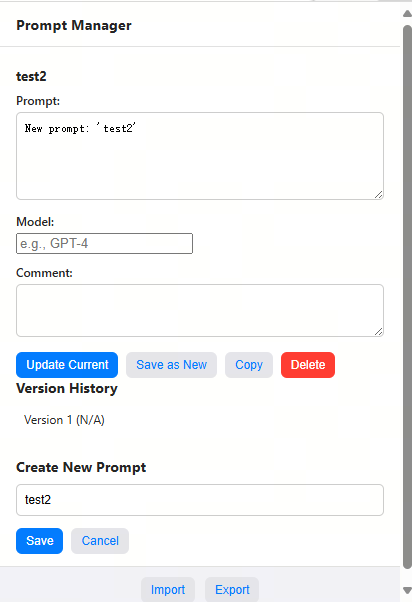

<div align="center">

# 🚀 Prompt Manager

**A powerful, privacy-focused browser extension for managing your AI prompt templates**

[](https://opensource.org/licenses/MIT)
[](https://github.com/moolean/Prompt_manager/releases)
[](CONTRIBUTING.md)

[Features](#-features) • [Installation](#-installation) • [Usage](#-usage) • [Screenshots](#-screenshots) • [Contributing](#-contributing) • [License](#-license)

</div>

---

## ✨ Features

### 🎯 Core Capabilities
- **📝 Create & Manage Prompts** - Add unlimited prompt templates and organize them efficiently
- **🔄 Version Control** - Track and manage multiple versions of each prompt
- **📋 Quick Copy** - Copy prompts to clipboard with a single click
- **💉 Smart Injection** - Right-click to inject prompts directly into any text field
- **🔒 Privacy First** - All data stored locally using Chrome Sync Storage - NO server connections
- **💾 Import/Export** - Backup and share your prompts easily with JSON import/export
- **🎨 Clean UI** - Modern, intuitive interface following platform design guidelines
- **⚡ Lightweight** - Fast and efficient with minimal resource usage

### 🔐 Privacy & Security
- ✅ 100% local storage - your prompts never leave your browser
- ✅ No external API calls or data collection
- ✅ No account or registration required
- ✅ Full control over your data with export functionality

---

## 📦 Installation

### For Users

#### Chrome Web Store / Edge Add-ons
*Coming soon - Store submission in progress*

#### Manual Installation (Developer Mode)

1. **Download the Extension**
   ```bash
   git clone https://github.com/moolean/Prompt_manager.git
   cd Prompt_manager
   ```
   
   Or download the [latest release](https://github.com/moolean/Prompt_manager/releases) as a ZIP file and extract it.

2. **Load in Your Browser**
   
   **For Chrome:**
   - Navigate to `chrome://extensions/`
   - Enable "Developer mode" (toggle in top-right corner)
   - Click "Load unpacked"
   - Select the project directory
   
   **For Microsoft Edge:**
   - Navigate to `edge://extensions/`
   - Enable "Developer mode" (toggle in bottom-left)
   - Click "Load unpacked"
   - Select the project directory

3. **Start Using!**
   - Click the extension icon in your toolbar to open Prompt Manager
   - Start creating your first prompt template

---

## 📖 Usage

### Creating Your First Prompt

1. Click the extension icon to open the popup
2. Click **"Add New Prompt"** button
3. Enter a name for your prompt (e.g., "Email Template", "Code Review", etc.)
4. Click **"Save"**
5. Start adding versions of your prompt with different variations

### Managing Prompts

- **View Prompts**: All your prompts are listed in the main view
- **Edit Prompt**: Click on any prompt to view and edit its content
- **Add Version**: Save multiple versions of the same prompt for A/B testing
- **Copy to Clipboard**: Click the copy button to quickly copy any prompt version
- **Delete**: Remove prompts you no longer need

### Using Prompts in Text Fields

**Method 1: Copy & Paste**
1. Open the extension popup
2. Navigate to your desired prompt
3. Click the "Copy" button
4. Paste (Ctrl+V / Cmd+V) into any text field

**Method 2: Right-Click Injection**
1. Right-click on any text input field (textarea, input, contentEditable)
2. Hover over "Inject Prompt" in the context menu
3. Select your prompt
4. The prompt text will be automatically inserted

### Import & Export

**Export Your Prompts:**
1. Open the extension popup
2. Click "Export" button
3. Save the JSON file to your preferred location

**Import Prompts:**
1. Open the extension popup
2. Click "Import" button
3. Select your previously exported JSON file
4. Your prompts will be restored

---

## 📸 Screenshots

### Main Interface

*Clean and intuitive main interface showing all your prompt templates*

### Creating a New Prompt

*Simple prompt creation workflow*

### Adding Prompt Content

*Version management and editing interface*

---

## 🛠️ Development

### Prerequisites
- A Chromium-based browser (Chrome, Edge, Brave, etc.)
- Basic knowledge of JavaScript and Chrome Extension APIs

### Project Structure
```
Prompt_manager/
├── manifest.json         # Extension configuration
├── popup.html           # Main popup UI
├── popup.js             # Popup logic
├── background.js        # Background service worker
├── content.js           # Content script for injection
├── options.html         # Settings page (if needed)
├── options.js           # Settings logic
├── icons/               # Extension icons
└── showImg/             # Screenshots for documentation
```

### Testing Locally
1. Make your changes to the code
2. Go to your browser's extensions page
3. Click "Reload" on the Prompt Manager extension
4. Test your changes

---

## 🤝 Contributing

We welcome contributions from the community! Whether it's:
- 🐛 Bug reports
- 💡 Feature requests
- 📝 Documentation improvements
- 🔧 Code contributions

Please see our [Contributing Guidelines](CONTRIBUTING.md) for more details.

---

## 🗺️ Roadmap

- [ ] Chrome Web Store publication
- [ ] Edge Add-ons Store publication
- [ ] Firefox support
- [ ] Tag/category system for prompts
- [ ] Search and filter functionality
- [ ] Keyboard shortcuts
- [ ] Dark mode theme
- [ ] Cloud sync option (optional, privacy-preserving)
- [ ] Prompt templates marketplace
- [ ] AI-powered prompt suggestions

---

## 📋 FAQ

**Q: Is my data safe?**  
A: Yes! All data is stored locally in your browser using Chrome Sync Storage. Nothing is sent to external servers.

**Q: Can I use this across multiple devices?**  
A: If you're signed into Chrome/Edge, your prompts will sync across devices using Chrome Sync Storage.

**Q: How do I backup my prompts?**  
A: Use the Export feature to save all your prompts as a JSON file.

**Q: Does this work with ChatGPT/Claude/other AI tools?**  
A: Yes! The extension works with any web-based text input field.

**Q: Is this open source?**  
A: Yes! This project is MIT licensed. Feel free to fork, modify, and contribute.

---

## 📄 License

This project is licensed under the MIT License - see the [LICENSE](LICENSE) file for details.

---

## 🙏 Acknowledgments

- Thanks to all contributors who help improve this project
- Inspired by the need for better prompt management in the AI era
- Built with ❤️ for the developer and AI enthusiast community

---

## 📞 Support

- **Issues**: [GitHub Issues](https://github.com/moolean/Prompt_manager/issues)
- **Discussions**: [GitHub Discussions](https://github.com/moolean/Prompt_manager/discussions)

---

<div align="center">

**If you find this project useful, please consider giving it a ⭐ star!**

Made with ❤️ by the Prompt Manager community

</div>
